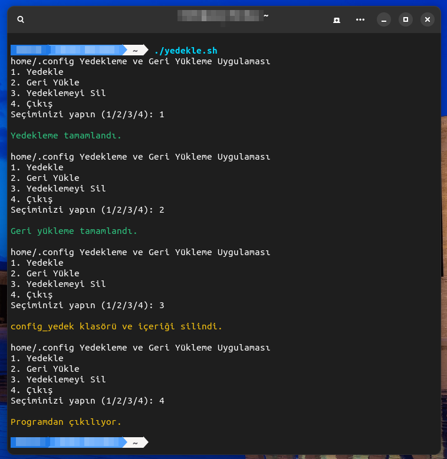

# linux-backup-app
Quick and Simple /home/.config Backup and Restore CLI Application Made with .SH Shell Script for Linux

Install Git Clone 

Github Package Must Be Installed On Your Device.
```bash
sudo apt install git  -y
```

----------------------------------

# Installation
Install Md5ISO-Verification
```bash
sudo git clone https://github.com/cektor/linux-backup-app.git
```
```bash
cd linux-backup-app/
```
```bash
sudo chmod +x yedekle.sh
```
```bash
./yedekle.sh
```

# Screenshot


